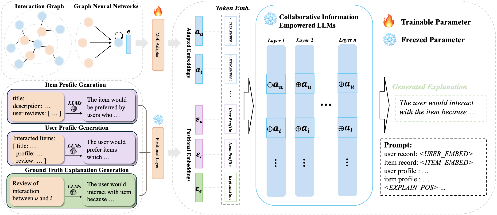

# XRec: Large Language Models for Explainable Recommendation


PyTorch implementation for [XRec: Large Language Models for Explainable Recommendation](http://arxiv.org/abs/2406.02377)

[2024.Sep]🎯🎯📢📢Our XRec is accepted by EMNLP'2024! Congrats to all XRec team! 🎉🎉🎉

> **XRec: Large Language Models for Explainable Recommendation**\
> Qiyao Ma, Xubin Ren, Chao Huang*\
> *EMNLP 2024*

-----

This paper presents a model-agnostic framework, **XRec**, that integrates the graph-based collaborative filtering framework with Large Language Models (LLMs) to generate comprehensive explanations for recommendations. By leveraging the inherent collaborative user-item relationships and harnessing the powerful textual generation capabilities of LLMs, XRec establishes a strong connection between collaborative signals and language semantics through the utilization of a Mixture of Experts (MoE) adapter.

<p align="center">

</p>

## Environment

Run the following command to install dependencies:

```
pip install -r requirements.txt
```

## Datasets

We utilize three public datasets: Amazon-books `amazon`, Google-reviews `google`, Yelp `yelp`. To generate user/item profile and explanations from scratch, you need to set up **Ollama** with a local language model. This project has been updated to use Ollama instead of OpenAI for cost-free, privacy-focused text generation.

### Quick Setup with Ollama

1. **Install Ollama and download models** (automated):
   ```bash
   python setup_ollama.py
   ```

2. **Manual setup** (if you prefer):
   ```bash
   # Install Ollama (Linux/macOS)
   curl -fsSL https://ollama.ai/install.sh | sh

   # Start Ollama service
   ollama serve

   # Download recommended model (in another terminal)
   ollama pull llama3.1:8b
   ```

3. **Install Python dependencies**:
   ```bash
   pip install -r requirements.txt
   ```

### Generation Scripts

Make sure Ollama is running (`ollama serve`) before running these scripts:

- **Item Profile Generation**:
  ```bash
  python generation/item_profile/generate_profile.py
  ```
- **User Profile Generation**:
  ```bash
  python generation/user_profile/generate_profile.py
  ```
- **Explanation Generation**:
  ```bash
  python generation/explanation/generate_exp.py
  ```

**Note**: You can change the model used by editing the `MODEL_NAME` variable in each script. Available options include:
- `llama3.1:8b` (recommended, ~4.7GB)
- `mistral:7b` (alternative, ~4.1GB)
- `codellama:7b` (for code-related tasks)
- `llama3.1:70b` (larger model, requires more resources)

### Why Ollama?

✅ **Free**: No API costs or usage limits
✅ **Privacy**: All data stays on your machine
✅ **Offline**: Works without internet connection
✅ **Performance**: Comparable quality to GPT-3.5-turbo
✅ **Flexibility**: Easy to switch between different models
✅ **Open Source**: Transparent and customizable

## Usage

Each of the below commands can be run independently. **No Hugging Face access token required** - the system now uses Ollama with local models for privacy and cost-free operation.

### Prerequisites

Make sure Ollama is running with the required model:
```bash
# Start Ollama service
ollama serve

# Download the model (if not already done)
ollama pull llama3.1:8b
```

### Commands

- To finetune the LLM from scratch:
  ```bash
  python explainer/main.py --mode finetune --dataset {dataset} --model_name llama3.1:8b
  ```
  s
- To generate explanations:
  ```bash
  python explainer/main.py --mode generate --dataset {dataset} --model_name llama3.1:8b
  ```
- To see sample generated explanations:
  ```bash
  python explainer/sample.py --dataset {dataset}
  ```
- To evaluate generated explanations:
  ```bash
  python evaluation/main.py --dataset {dataset}
  ```

### Supported Options

- **Datasets**: `amazon`, `google`, `yelp`
- **Models**: `llama3.1:8b`, `mistral:7b`, `codellama:7b`, `llama3.1:70b` (or any Ollama model)

### Model Selection

You can specify different Ollama models using the `--model_name` parameter:
```bash
# Use Mistral 7B
python explainer/main.py --mode generate --dataset amazon --model_name mistral:7b

# Use larger LLaMA model (requires more resources)
python explainer/main.py --mode generate --dataset amazon --model_name llama3.1:70b
```

## Example

Below is an example of generating explanation for a specific user-item recommendation using the ``yelp`` dataset.

### Input

- Item profile processed by GPT:
  ```
  MD Oriental Market, is summarized to attract Fans of Asian cuisine, individuals looking for a variety of Asian products, and those seeking unique and ethnic food items would enjoy MD Oriental Market. Customers interested in a well-organized, spacious, and clean grocery store with a diverse selection of Asian ingredients and products would also appreciate this location.
  ```
- User profile processed by GPT:
  ```
  This user is likely to enjoy casual American comfort food, barbecue with various meat options and tasty sauces, high-quality dining experiences with tasting menus, and authentic Italian food and beverages in cozy atmospheres.
  ```
- User/Item interaction history processed by Graph Neural Networks (GNNs)

### Output

- Explanation for the user-item recommendation:
  ```
  The user would enjoy this business for its vast selection of Asian ingredients, including fresh produce, sauces, condiments, and spices, making it a go-to for authentic and diverse cooking options.
  ```

## Code Structure

```
├── README.md
├── data (amazon/google/yelp)
│   ├── data.json                         # user/item profile with explanation
│   ├── trn/val/tst.pkl                   # separation of data.json
│   ├── total_trn/val/tst.csv             # user-item interactions
│   ├── user/item_emb.pkl                 # user/item embeddings
│   ├── user/item_converter.pkl           # MoE adapter
│   ├── tst_pred.pkl                      # generated explanation
│   └── tst_ref.pkl                       # ground truth explanation
├── encoder
│   ├── models                            # GNN structure
│   ├── utils
│   └── train_encoder.py                  # derive user/item embeddings
├── explainer
│   ├── models
│   │   ├── explainer.py                  # XRec model
│   │   └── modeling_explainer.py         # modified PyTorch LLaMA model
│   ├── utils
│   ├── main.py                           # employ XRec  
│   └── sample.py                         # see samples of generated explanations
├── generation
│   ├── instructions                      # system prompts for user/item profile and
│   ├── explanations
│   ├── item_profile                      # generate item profile
│   │   ├── item_prompts.json
│   │   ├── item_system_prompt.json
│   │   └── generate_profile.py
│   ├── user_profile                      # generate user profile
│   │   ├── user_prompts.json
│   │   ├── user_system_prompt.json
│   │   └── generate_profile.py
│   └── explanation                       # generate ground truth explanation
│       ├── exp_prompts.json
│       ├── exp_system_prompts.json  
│       └── generate_exp.py
└── evaluation
    ├── main.py
    ├── metrics.py   
    └── system_prompt.txt                  # system prompt for GPTScore
```

## Citation

If you find XRec helpful to your research or applications, please kindly cite:

```bibtex
@article{ma2024xrec,
  title={XRec: Large Language Models for Explainable Recommendation},
  author={Ma, Qiyao and Ren, Xubin and Huang, Chao},
  journal={arXiv preprint arXiv:2406.02377},
  year={2024}
}
```
## 🚀 Quick Start

### Prerequisites
- Python 3.8+
- CUDA-compatible GPU (recommended)
- 8GB+ RAM

### Installation

1. **Clone the repository**:
   ```bash
   git clone https://github.com/AnandMayank/XRec.git
   cd XRec
   ```

2. **Set up virtual environment**:
   ```bash
   python -m venv .venv
   source .venv/bin/activate  # On Windows: .venv\Scripts\activate
   ```

3. **Install dependencies**:
   ```bash
   pip install -r requirements.txt
   ```

4. **Set up Ollama**:
   ```bash
   python setup_ollama.py
   ```

5. **Run XRec**:
   ```bash
   python explainer/main.py --mode generate --dataset amazon --model_name llama3.1:8b
   ```

## 🧪 Testing

Verify the installation:
```bash
python test_ollama_integration.py
python check_migration.py
```

## 📊 Evaluation

For evaluation with BERT scores, you'll need a Hugging Face token:
```bash
huggingface-cli login
python evaluation/main.py --dataset amazon
```

## 🔧 Troubleshooting

See [OLLAMA_MIGRATION_GUIDE.md](OLLAMA_MIGRATION_GUIDE.md) for detailed troubleshooting and migration information.

## 📈 Performance

- **Privacy**: All processing happens locally
- **Cost**: No API fees
- **Speed**: Comparable to cloud-based solutions
- **Flexibility**: Easy model switching